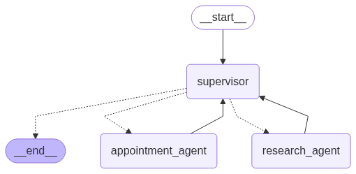

# FastAPI Application



🚀 This AI-powered system delivers intelligent customer interaction and advanced document understanding by combining OCR-based parsing, Retrieval-Augmented Generation (RAG), live web search, and multi-agent orchestration—enabling seamless document-driven conversational intelligence.

It processes both scanned and digital PDFs using Docling integrated with Tesseract OCR, converting them into structured Markdown and storing semantic embeddings in PostgreSQL with PGVector. A sophisticated hybrid retrieval engine leverages vector similarity and BM25 keyword search, further refined by a cross-encoder reranker to produce high-precision, context-aware responses.

The system features specialized agents coordinated by a central Supervisor to ensure modular and scalable automation. The Research Agent enriches responses by retrieving relevant internal documents through the RAG pipeline and augmenting information with real-time web search, skillfully balancing internal knowledge with live external data. Meanwhile, the Appointment Agent handles complete appointment scheduling workflows by fetching the current time, retrieving available customer service representative slots from the database, and booking appointments while logging all necessary information.

This comprehensive design empowers domain-specific automation with natural, dynamic interactions grounded in both deep document understanding and up-to-date external knowledge, making it ideal for smart enterprise assistants, document-intensive workflows, and context-aware support systems.

---

## Project Highlights and Flow Design

This FastAPI application is designed to handle customer interactions and manage document processing efficiently. Below is a detailed breakdown of the flow design, key components, and the logic behind critical decisions.

### 1. Parsing Strategy
The application uses the `docling` library to process uploaded PDF documents. The pipeline includes:
- **OCR with Tesseract**:
  - Utilizes `docling`'s integration with Tesseract for Optical Character Recognition (OCR).
  - Extracts text from scanned PDFs, ensuring compatibility with non-digital documents.
  - Handles multi-page PDFs and supports multiple languages.
- **Markdown Conversion**:
  - Converts the extracted text into Markdown format using `docling`'s document conversion capabilities.
  - Markdown provides a lightweight and human-readable format for further processing.
- **Header-Based Splitting**:
  - Splits the Markdown content into smaller chunks using `langchain`'s markdowntextsplitter.
  - This ensures better embedding and retrieval by breaking the content into meaningful sections.

### 2. Retrieval-Augmented Generation (RAG) Strategy
The application implements a Retrieval-Augmented Generation (RAG) approach to enhance query responses:
- **Vector Store**:
  - Uses `PGVector` to store document embeddings in a PostgreSQL database.
  - Embeddings are generated using state-of-the-art models for semantic similarity.
- **Retrievers**:
  - **Similarity Retriever**:
    - Retrieves documents based on vector similarity, ensuring semantically relevant results.
  - **BM25 Retriever**:
    - Retrieves documents using BM25 ranking for keyword-based search.
    - Complements the similarity retriever by handling exact keyword matches.
- **Ensemble Retriever**:
  - Combines the similarity and BM25 retrievers with weighted scores to balance semantic and keyword-based retrieval.
- **Cross-Encoder Reranker**:
  - Refines the retrieved results using a Hugging Face cross-encoder model.
  - Ensures that the most contextually relevant results are prioritized.

### 3. Supervisor and Tools Orchestration
The application orchestrates multiple tools and agents using a supervisor for modular and scalable task management:
- **Research Agent**:
  - Handles research-related tasks by retrieving documents and performing web searches.
  - Integrates with retriever_tool incorporating the RAG pipeline for document retrieval, and web_search tool for getting specific information.
- **Appointment Agent**:
  - Manages appointment scheduling tasks, including finding available slots and booking appointments.
  - It manages three tools findCurrentTime, getSlots and bookSlot, for fetching current time, fetching all available slots and booking the slot with an CSR.
  - Interacts with the database to retrieve and log all the information
- **Supervisor**:
  - Coordinates the agents, ensuring tasks are assigned to the appropriate agent.
  - Manages the flow of information between agents and tools, ensuring seamless task execution.

### 4. Database Design
The application uses PostgreSQL as the primary database for storing all the information:
- **Vector Embeddings**:
  - Stored in the `langchain_pg_embedding` table for document retrieval.
- **Agent details**:
  - Stored in the `agents` table, containing agent_id, name, email, gender.
- **Appointment details**:
  - Stored in the `appointments` table, containing agent avaibility by date and time, with allocation for customer.
- **Customers**:
  - Stored in the `customers` table, containing customer profiles like customer_id, name, email, gender.
- **Checkpoint Tables**:
  - Includes `checkpoint_blobs`, `checkpoint_migrations`, `checkpoint_writes`, and `checkpoints` for managing application checkpoints and migrations.

### 5. API Design
The application provides RESTful APIs for seamless interaction:
- **Customer Query API**:
  - Allows users to query customer data and retrieve relevant information.
- **Document Upload API**:
  - Enables users to upload PDF documents for processing and retrieval.

---

## Key Design Decisions

### Parsing Strategy
- **Why Docling?**
  - Docling is an open-source tool that streamlines document processing across formats, with advanced PDF parsing and seamless GenAI integration.
  - Supports EasyOCR and Tesseract supporting extraction from scanned documents.
- **Why Markdown Conversion?**
  - Markdown provides a structured format for processing and splitting content into meaningful chunks.

### RAG Strategy
- **Why PGVector for Vector Storage?**
  - PGVector integrates seamlessly with PostgreSQL, allowing vector embeddings to be stored alongside relational data.
  - This reduces the need for a separate vector database.
- **Why Ensemble Retrieval?**
  - Combining similarity-based and keyword-based retrievers ensures robust and accurate document retrieval.
- **Why Cross-Encoder Reranking?**
  - Cross-encoders provide context-aware reranking, improving the relevance of retrieved results.

### Supervisor and Tools Orchestration
- **Why Use a Supervisor?**
  - The Supervisor ensures that tasks are routed to the correct agent, enabling modular and scalable task management.
- **Why Specialized Agents?**
  - Each agent is designed for a specific purpose (e.g., research, appointment scheduling), ensuring focused and efficient task handling.

### Database Design
- **Why PostgreSQL?**
  - PostgreSQL is a robust relational database that supports extensions like PGVector for vector storage.
  - When integrated with LangChain, it provides a powerful solution for persistent memory.
  - This facilitates a unified infrastructure for maintenance and scalability.

### API Design
- **Why RESTful APIs?**
  - RESTful APIs provide a simple and widely adopted interface for client-server communication.
  - They ensure compatibility with various front-end and third-party tools.

---

## Conversation Flow

A sample thread level conversation traces could be found at https://smith.langchain.com/public/876b425a-6931-4580-865f-9fda3143f8f0/d with built-in langsmith integration

## Dependencies

The application requires the following dependencies, as listed in [`requirements.txt`](requirements.txt):
- **FastAPI**: For building the web application.
- **LangChain and LangGraph**: For RAG and workflow orchestration.
- **PGVector**: For vector-based document storage.
- **Docling**: For text extraction from general and scanned PDFs.
- **Hugging Face Transformers**: For cross-encoder reranking.
- **PostgreSQL**: For storing vector embeddings and application data.

---

## Database Information

### PostgreSQL
The application uses a PostgreSQL database to store:
- **Vector Embeddings**: Stored in the `langchain_pg_embedding` table for document retrieval.
- **agents**: Stores information about the agents used in the application.
- **appointments**: Manages customer appointment data, including scheduling and availability.
- **checkpoint_blobs, checkpoint_migrations, checkpoint_writes, checkpoints**: Used for managing application checkpoints and migrations.
- **customers**: Stores customer-related data, such as profiles and interactions.
- **langchain_pg_collection**: Contains metadata about document collections for retrieval.
- **langchain_pg_embedding**: Stores vector embeddings for documents to enable similarity-based retrieval.

Ensure the database is set up with the appropriate schema before running the application.

---

## Installation and Setup

Follow these steps to set up and run the application:

### 1. Clone the Repository
```bash
git clone https://github.com/infinityarpan/multiagentic-hybrid-chat-app.git
cd fastapi-app
```

### 2. Set Up the Environment
- Create a virtual environment (optional but recommended):
  ```bash
  python -m venv venv
  source venv/bin/activate  # On Windows use `venv\Scripts\activate`
  ```
- Install the required dependencies:
  ```bash
  pip install -r requirements.txt
  ```

### 3. Configure the Environment Variables
- Update the `.env` file with your API keys, database URI, and other configurations:
  ```env
  LANGCHAIN_TRACING_V2=true
  LANGCHAIN_TRACING=true
  TAVILY_API_KEY=<your-tavily-api-key>
  LANGSMITH_TRACING_V2=true
  LANGSMITH_TRACING=true
  LANGSMITH_ENDPOINT=https://api.smith.langchain.com
  LANGSMITH_API_KEY=<your-langsmith-api-key>
  LANGSMITH_PROJECT=<your-langsmith-project>
  OPENAI_API_KEY=<your-openai-api-key>
  DB_URI=postgresql://<username>:<password>@<host>:<port>/<database>
  VECTOR_COLLECTION_NAME=<your-vector-collection-name>
  ```

### 4. Set Up the Database and Reranker
- Ensure PostgreSQL is running and accessible.
- Create the necessary tables for customers, agents and appointments.
- Download the BAAI/bge-reranker-v2-m3 reranker
- Run the database and reranker setup script to create the necessary tables and download the reranker:
  ```bash
  python app/setup_scripts/create_agents.py
  python app/setup_scripts/create_customers.py
  python app/setup_scripts/create_appointments.py
  python app/setup_scripts/download_reranker.py
  ```

### 5. Run the Application
- Start the FastAPI application:
  ```bash
  uvicorn app.main:app --port 8000 --reload
  ```
- The server will be available at `http://127.0.0.1:8000`.

---

## API Endpoints

### Process Customer Query
- **Endpoint:** `/api/customer/query`
- **Method:** `POST`
- **Request Body:**
  ```json
  {
    "customer_id": "string",
    "thread_id": "string",
    "user_query": "string"
  }
  ```

### Upload PDF Document
- **Endpoint:** `/api/documents/upload_pdf`
- **Method:** `POST`
- **Request Body:** Form data with a file upload.

---

## Contributing

Contributions are welcome! Please open an issue or submit a pull request for any enhancements or bug fixes.

---

## License

This project is licensed under the MIT License. See the LICENSE file for more details.